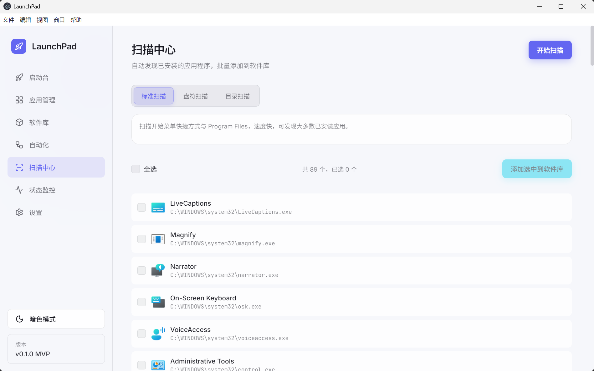
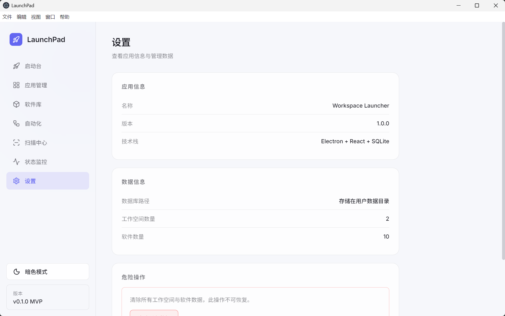

<div align="center">

# 🚀 LaunchPad

### 把每天重复打开的软件，变成真正的「一键启动」

一款简洁、开源、专为 Windows 打造的工作空间管理与软件启动器。  
自由组合开发、办公、创作或游戏应用，设置启动顺序与延迟，一次点击进入状态。

[](https://github.com/MewzCC/workspace-launcher/releases/latest)
[](https://github.com/MewzCC/workspace-launcher/releases)
[](LICENSE)
[](https://github.com/MewzCC/workspace-launcher/releases/latest)

[⬇️ 下载最新版](https://github.com/MewzCC/workspace-launcher/releases/latest) ·
[✨ 功能亮点](#-为什么选择-launchpad) ·
[🛠️ 本地开发](#️-本地开发) ·
[💬 反馈建议](https://github.com/MewzCC/workspace-launcher/issues)

</div>


## 🆕 v1.4.2：更新体验与数据路径完善

- 🔎 **输入即搜索**：无需先执行扫描，直接通过 Everything 与 Windows 应用索引查找软件。
- ⏹️ **扫描可取消**：标准、盘符和目录扫描均可随时停止，切换界面或盘符不会再丢失已有结果。
- 🧠 **进程管理控制台**：按应用名称、PID 或监听端口定位进程，分页浏览并安全结束目标进程。
- 🔄 **自动更新**：安装版自动检查 GitHub Releases，下载完成后点击“重启并安装”或关闭应用即自动安装。
- 📝 **更新日志弹窗**：更新完成后展示本次更新内容。
- 📁 **用户数据路径**：数据目录跟随安装路径，更新与卸载始终保留工作空间和设置。

[查看 v1.4.2 完整更新日志](CHANGELOG.md#142---2026-08-12)

## 💡 LaunchPad 是什么？

每天开始工作时，你是否需要依次打开编辑器、浏览器、聊天工具、终端和文档？玩游戏前，又要逐个启动平台、加速器与辅助工具？

**LaunchPad 把这些重复操作收进一个工作空间。** 选择需要的软件、调整启动顺序和间隔，之后只需点击一次「一键启动」，就能快速进入工作、学习、创作或游戏状态。

数据保存在本机 SQLite 数据库中，不依赖云端账号，开箱即用。

## ✨ 为什么选择 LaunchPad？

| 功能 | 说明 |
| --- | --- |
| 🚀 **一键启动** | 将多个 Windows 软件组合为工作空间，一次点击批量启动 |
| 🛰️ **系统托盘** | 关闭窗口后继续驻留，可从托盘显示窗口或直接一键启动工作空间 |
| ⚡ **开机启动** | 登录 Windows 后自动运行，并可选择静默驻留系统托盘 |
| 🧩 **自由编排** | 为每个软件设置启动顺序和延迟，减少开机拥堵 |
| 🔍 **智能扫描** | 扫描开始菜单、Program Files、指定磁盘或目录；支持取消并保留扫描结果 |
| 🔎 **即时搜索** | 无需预扫描，按应用名称实时查询 Everything 与 Windows 应用索引 |
| 📦 **软件库** | 集中管理可执行文件、启动参数、图标和描述 |
| 🧠 **进程管理** | 按应用名称、PID 或监听端口搜索进程，分页查看资源占用并结束目标进程 |
| 🛡️ **启动验证** | 添加前实际测试程序；启动失败、权限受限或路径异常的软件不会写入软件库 |
| 🖥️ **BAT 脚本库** | 管理并一键运行本地 `.bat` / `.cmd` 自动化脚本 |
| ⚙️ **自动化脚本** | 支持启动前后命令，并可在软件启动后按顺序自动运行脚本库中的 BAT/CMD |
| 🔄 **进程重启策略** | 可在启动工作空间前按完整 EXE 路径结束已有实例，再重新启动软件 |
| 📈 **状态与日志** | 查看启动进度、运行状态和历史记录 |
| 🔁 **自动更新** | 安装版自动检查 GitHub Releases，支持下载进度与重启安装 |
| 🌗 **明暗主题** | 现代化浅色/深色界面，适配不同使用环境 |
| 🌍 **多语言** | 支持简体中文、English 和日本語，菜单与系统托盘同步切换 |
| 🔒 **本地优先** | 配置与数据存储在本机，无需注册登录 |

## 📸 界面预览

### 🧭 工作空间管理

将常用软件按场景分组：开发、办公、游戏、直播或学习，都可以拥有自己的启动方案。


### ➕ 添加软件

支持选择可执行文件、设置启动参数与图标，常用工具统一收纳。


### 🔎 扫描中心

无需预扫描即可搜索应用；也支持标准扫描、盘符扫描和目录扫描，扫描过程中可随时取消，已有结果会持续保留。



### 🧠 进程管理

按应用名称、PID 或监听端口快速定位进程，以固定分页列表查看内存占用和监听状态，并可结束不再需要的进程。


### ⚙️ 设置与本地数据

清楚展示版本、技术栈和本地数据状态，所有配置都由你掌控。



## 📥 下载与安装

前往 [GitHub Releases](https://github.com/MewzCC/workspace-launcher/releases/latest) 下载：

- **`LaunchPad-Setup-1.4.2-x64.exe`**：推荐，大多数用户选择此安装包；支持自选安装目录，并创建桌面与开始菜单快捷方式。
- **`LaunchPad-Portable-1.4.2-x64.exe`**：免安装便携版，双击即可运行。

> 当前版本面向 Windows 10/11 x64。安装包暂未购买商业代码签名证书，Windows SmartScreen 可能显示未知发布者；请仅从本仓库 Release 页面下载。

## 🚀 三步开始一键启动

1. 在「扫描中心」自动发现软件，或在「软件库」手动添加程序。
2. 新建工作空间，选择软件并设置启动顺序、延迟时间。
3. 回到「启动台」或「空间管理」，点击 **一键启动**。

## 🛠️ 本地开发

环境要求：Node.js 18+、npm、Windows。

```bash
git clone https://github.com/MewzCC/workspace-launcher.git
cd workspace-launcher
npm install
npm run dev
```

构建生产版本：

```bash
# 仅构建应用
npm run build

# 构建 Windows 安装包与便携版
npm run dist:win
```

构建产物会输出到 `release/`。

## 🧱 技术栈

- ⚛️ React 18 + Zustand
- ⚡ Vite + Electron Vite
- 🖥️ Electron 31
- 🗃️ SQLite / better-sqlite3
- 🎨 Lucide React + 原生 CSS
- 📦 electron-builder + NSIS

## 🗺️ 开发日程

### ✅ v1.4.1 已完成

- [x] 系统托盘、开机启动与静默驻留
- [x] 进程管理、PID/端口检索与分页加载
- [x] Everything 即时应用搜索、扫描缓存与取消扫描
- [x] 工作空间运行状态识别与启动日志优化
- [x] 简体中文、English、日本語多语言支持
- [x] Windows 主程序、安装包与托盘图标更新
- [x] 安装版自动更新检查、下载进度与重启安装
- [x] 更新日志预览、安装目录数据存储和动态版本展示

### 🎯 下一阶段

- [ ] 工作空间配置导入与导出
- [ ] 更多自动化脚本模板、变量和执行条件
- [ ] 进程 CPU 趋势与更丰富的资源监控

欢迎在 [Issues](https://github.com/MewzCC/workspace-launcher/issues) 提交建议或问题，也欢迎贡献代码。

## 🤝 参与贡献

1. Fork 本仓库并创建功能分支。
2. 提交清晰、聚焦的改动。
3. 确认 `npm run build` 通过。
4. 发起 Pull Request，并说明改动动机与测试方式。

## 📄 开源协议

本项目基于 [MIT License](LICENSE) 开源。

<div align="center">

如果 LaunchPad 帮你少点几次鼠标，欢迎点亮一个 ⭐  
你的 Star 会让更多需要「Windows 一键启动」和「工作空间管理」的用户发现它。

</div>
